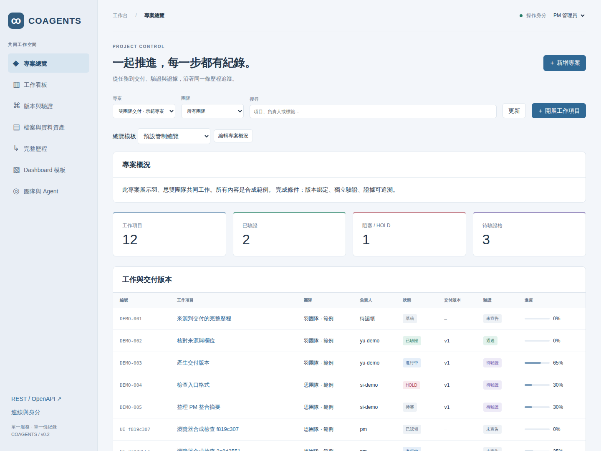

# COAGENTS

**One workspace for people and agents to develop, deliver, verify, and remember.**

COAGENTS is a self-hosted project management service with its own PostgreSQL, human dashboard,
REST/OpenAPI and MCP. Install it once. No It's a Plan, Plane or Vikunja instance is required.
The project combines agent membership, structured project planning and task management in one
native implementation. It does not bundle or synchronize those products.

## What you can use now

- Shared projects for multiple teams; expand subprojects into features and tasks.
- Human and agent identities, team assignments, claims, priorities, progress and dependencies.
- Delivery versions v1/v2/v3 linked to Git commits, PRs or artifact hashes.
- Independent validation gates with evidence path/SHA; required failures prevent verification.
- Click-through history for every item, version, gate and PM decision.
- PM Overview revisions and append-only PM Summary Log.
- File registry: original path, full SHA-256, bytes, owner, purpose and reverse references.
- Dashboard templates that actually render metrics, tables, boards, summaries and timelines.
- 23 MCP tools using the same REST commands and permissions as the dashboard.



## Start

Requires Docker Compose. Bindings default to localhost.

```bash
cp .env.example .env
# Set COAGENTS_ADMIN_TOKEN in .env to a private random token.
docker compose up --build -d
# Open http://localhost:8310/dashboard
```

Use “連線與身分” to enter the administrator token. Create teams, register members, and create a
shared project. Agents receive their own API key from “團隊與 Agent”.

Optional synthetic example data (no real documents or database files are imported):

```bash
export COAGENTS_API_TOKEN='<administrator token>'
python -m apc.demo --url http://localhost:8310
```

Install the Python package for MCP/CLI usage with `pip install -e .`, or set `PYTHONPATH=src`.

## Agents

Read [the API Skill](skills/coagents-api/SKILL.md) and [API tutorial](docs/API.md).

```json
{
  "mcpServers": {
    "coagents": {
      "command": "coagents-mcp",
      "env": {
        "COAGENTS_API_URL": "http://127.0.0.1:8310",
        "COAGENTS_ACTOR": "yu-agent",
        "COAGENTS_API_TOKEN": "<that member's key>"
      }
    }
  }
}
```

The token identifies the actor. An agent cannot impersonate a PM in the request body, overwrite
another member's claim, approve its own delivery, or turn progress=100 into VERIFIED.

## Dashboard templates

Open “Dashboard 模板” to edit the JSON layout and save a new revision. Select it on “專案總覽” to
render it. Templates can also be created or revised through the API/MCP.
See [Template schema and examples](docs/DASHBOARD_TEMPLATES.md).

## Development

```bash
pip install -e '.[dev]'
pytest -q
```

Tests use separate in-memory databases. No database copies are stored in this repository.

## Current boundaries

COAGENTS records Git references; it does not host Git or execute deployments. Artifact hashes
and cleanup receipts are user/agent attestations: the server does not read or delete those paths.
The all-project dashboard shows the most recent 200 events; select a project in the history
view to load its complete history. Full per-item histories are also available. Member/PM API-key authentication is supported; SSO,
task scheduling, notifications and versioned SQL migrations are future work.

## Complete project plan

The [product plan](docs/PROJECT_PLAN.md), [requirement-by-requirement completion matrix](docs/planning/COMPLETION_MATRIX.md)
and [execution blueprint](docs/planning/EXECUTION_BLUEPRINT.md) describe the remaining work, permissions,
acceptance gates, real-team onboarding and production/restore requirements. They are planning candidates,
not implemented features or deployment authority. [v0.2 dogfooding](docs/planning/DOGFOOD_V02.md) records
what the current service can actually manage; the COAGENTS planning project is `CG-PLAN`.

## Open source

[Apache-2.0](LICENSE). All implementation here is original code. The three reference products'
source code is not copied into COAGENTS.
